# FlexoTwin Digital Maintenance System - Flowchart

## Sistem Architecture Overview

```mermaid
graph TB
    A[👤 User Interface<br/>Streamlit Web App] --> B[🏗️ FlexoDigitalTwin<br/>Core Engine]

    B --> C{🔍 System Status<br/>Check}

    C -->|Not Trained| D[📚 Data Loading<br/>Process]
    C -->|Trained| E[📊 Dashboard<br/>Display]

    D --> F[📂 Load Training Data<br/>4 CSV Files]
    F --> G{📋 Data<br/>Available?}

    G -->|Yes| H[🤖 Train Models<br/>OEE, Failure, RUL]
    G -->|No| I[🔧 Generate Synthetic<br/>Training Data]

    I --> H
    H --> J[✅ Models Trained<br/>Status: Ready]
    J --> E

    E --> K[📱 Tab Navigation]

    K --> L[📊 Dashboard Tab]
    K --> M[🔮 Predictions Tab]
    K --> N[📈 Analytics Tab]

    L --> O[🏭 Component Status<br/>8 FLEXO Components]
    L --> P[📊 Performance Charts<br/>15+ Visualizations]

    M --> Q[📝 Input Data<br/>September 2025]
    Q --> R[🔮 Generate Predictions<br/>October 2025]
    R --> S[📋 Results Display<br/>OEE, RUL, Risk]

    N --> T[📈 Trend Analysis]
    N --> U[🔍 Methodology Display<br/>8-Step Process]
    N --> V[📊 Historical Analytics]
```

## Data Flow Architecture

```mermaid
graph LR
    A[📂 Raw Data Sources] --> B[🔄 Data Processing<br/>Pipeline]

    B --> C[📊 Training Data<br/>Sep 2024 - Aug 2025]
    B --> D[📝 Input Data<br/>Sep 2025]

    C --> E[🤖 ML Models<br/>Training Process]

    E --> F[🎯 OEE Model<br/>RandomForest]
    E --> G[⚠️ Failure Model<br/>GradientBoosting]
    E --> H[⏰ RUL Model<br/>Regression]

    D --> I[📋 Prediction<br/>Engine]
    F --> I
    G --> I
    H --> I

    I --> J[📊 October 2025<br/>Predictions]
    J --> K[📱 User Interface<br/>Results Display]
```

## Component Monitoring System

```mermaid
graph TD
    A[🏭 FLEXO 104 Machine] --> B[📊 8 Component<br/>Monitoring]

    B --> C[🔧 PRE FEEDER]
    B --> D[📥 FEEDER]
    B --> E[🖨️ PRINTING 1]
    B --> F[🖨️ PRINTING 2]
    B --> G[🖨️ PRINTING 3]
    B --> H[🖨️ PRINTING 4]
    B --> I[✂️ SLOTTER]
    B --> J[📤 DOWN STACKER]

    C --> K[📈 Health Score<br/>85.2%]
    D --> L[📈 Health Score<br/>78.5%]
    E --> M[📈 Health Score<br/>92.1%]
    F --> N[📈 Health Score<br/>81.3%]
    G --> O[📈 Health Score<br/>67.8% ⚠️]
    H --> P[📈 Health Score<br/>75.9%]
    I --> Q[📈 Health Score<br/>89.4%]
    J --> R[📈 Health Score<br/>82.7%]

    K --> S[🎯 Risk Assessment<br/>& Predictions]
    L --> S
    M --> S
    N --> S
    O --> S
    P --> S
    Q --> S
    R --> S
```

## 8-Step Methodology Implementation

```mermaid
graph TB
    A[📋 8-Step Digital Twin<br/>Methodology] --> B[Step 1: 📊 Data Collection<br/>Historical & Real-time]

    B --> C[Step 2: 🧹 Data Preprocessing<br/>Cleaning & Validation]
    C --> D[Step 3: 🐟 Root Cause Analysis<br/>Fishbone Diagram]
    D --> E[Step 4: ⚠️ FMEA Analysis<br/>Risk Assessment]
    E --> F[Step 5: 🤖 Model Development<br/>ML Training]
    F --> G[Step 6: ✅ Model Validation<br/>Performance Testing]
    G --> H[Step 7: 🚀 System Deployment<br/>Production Ready]
    H --> I[Step 8: 🔄 Continuous Monitoring<br/>Real-time Updates]

    D --> J[👨 Man Factors<br/>Operator Skills]
    D --> K[🏭 Machine Factors<br/>Component Health]
    D --> L[📋 Method Factors<br/>Procedures]
    D --> M[📦 Material Factors<br/>Quality Control]
    D --> N[🌡️ Environment Factors<br/>Conditions]

    E --> O[⚠️ FMEA Results<br/>RPN Calculations]
    O --> P[📊 Risk Prioritization<br/>Action Plans]
```

## Visualization Dashboard Flow

```mermaid
graph LR
    A[📊 Dashboard System] --> B[🏠 Main Dashboard]

    B --> C[📈 Component Health<br/>Bar Charts]
    B --> D[📊 OEE Trends<br/>Time Series]
    B --> E[🎯 Performance Gauges<br/>TPM Metrics]
    B --> F[📅 Monthly Analysis<br/>Comparisons]
    B --> G[🔄 Shift Analysis<br/>Performance]

    A --> H[🔮 Predictions Tab]
    H --> I[📝 Input Forms<br/>September Data]
    H --> J[🎯 Prediction Results<br/>October Forecasts]
    H --> K[📋 Risk Assessment<br/>Maintenance Schedule]

    A --> L[📈 Analytics Tab]
    L --> M[📊 Trend Analysis<br/>Historical Patterns]
    L --> N[🔍 Methodology View<br/>8-Step Process]
    L --> O[📊 Performance Metrics<br/>KPI Dashboard]
    L --> P[📈 Comparative Analysis<br/>Multi-dimensional]
```

## Error Handling & Fallback System

```mermaid
graph TD
    A[🚀 System Start] --> B{📊 Training Data<br/>Available?}

    B -->|Yes| C[📂 Load CSV Files<br/>4 Data Sources]
    B -->|No| D[🔧 Generate Synthetic<br/>Training Data]

    C --> E{📋 Data Valid<br/>& Complete?}
    E -->|Yes| F[🤖 Train Models<br/>ML Pipeline]
    E -->|No| D

    D --> G[📊 Create Mock Data<br/>12 Month Pairs]
    G --> F

    F --> H{✅ Training<br/>Successful?}
    H -->|Yes| I[🎯 Production Mode<br/>Real Predictions]
    H -->|No| J[⚠️ Default Mode<br/>Static Predictions]

    I --> K[📱 Full Interface<br/>All Features]
    J --> L[📱 Limited Interface<br/>Basic Features]
```

## Real-time Processing Pipeline

```mermaid
sequenceDiagram
    participant U as 👤 User
    participant UI as 📱 Streamlit UI
    participant DT as 🤖 Digital Twin
    participant ML as 🧠 ML Models
    participant DB as 📊 Data Storage

    U->>UI: Access Dashboard
    UI->>DT: Initialize System
    DT->>DB: Load Training Data
    DB-->>DT: Return Data
    DT->>ML: Train Models
    ML-->>DT: Models Ready
    DT-->>UI: System Initialized
    UI-->>U: Display Dashboard

    U->>UI: Input September Data
    UI->>DT: Process Input
    DT->>ML: Generate Predictions
    ML-->>DT: October Forecasts
    DT-->>UI: Return Results
    UI-->>U: Show Predictions

    U->>UI: View Analytics
    UI->>DT: Fetch Analytics
    DT->>DT: Process Methodology
    DT-->>UI: Return Analysis
    UI-->>U: Display Charts
```

